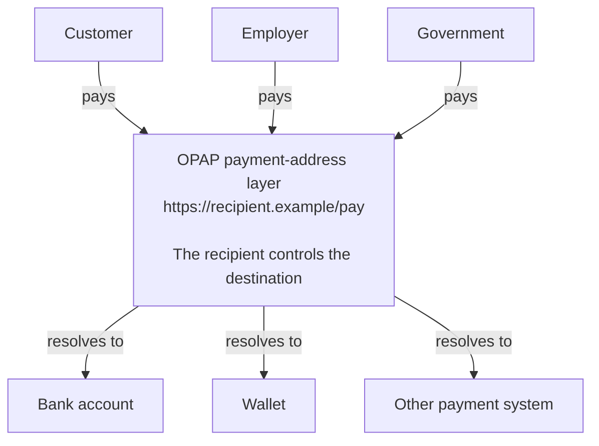

# Open Payment Address Protocol (OPAP)

> A vendor-neutral protocol for publishing and resolving payment instructions from canonical HTTPS URLs.

**Status:** OPAP/1 implementation draft. The specification, schema and conformance fixtures in this repository are the canonical source for this revision. Production payment execution is outside the protocol and is not enabled by this repository.

## DNS for money

**The internet has URLs. Now money does too.**

OPAP turns a canonical public HTTPS URL—including a page on your own domain—into a universal payment address. Anyone can use it to pay. The recipient alone decides where the money arrives.

```text
DNS:  recipient.example             → where to find it
OPAP: https://recipient.example/pay → how to pay it
```

What DNS did for finding websites, OPAP does for getting paid: it connects a stable public name to a destination that can change without changing the name.



The arrows show discovery and routing, not custody. OPAP does not hold or move money. Banks, wallets, chains, and future payment systems continue to settle payments exactly as they do today.

## A freedom protocol

A payment address should belong to its recipient—not to the bank, wallet, marketplace, or platform currently serving them. OPAP separates the stable public identity people pay from the replaceable destination where the money arrives. Keep the URL; change the provider, account, wallet, rail, or routing policy behind it.

There is no central OPAP operator that can suspend an address or demand permission before one is published. Anyone who controls an HTTPS URL can publish payment instructions, and any compatible payer can resolve them. That removes the central directory, platform account, or proprietary payment identifier as a censorship and debanking chokepoint.

A bank may close an account and a wallet provider may block its service, but neither owns the recipient's OPAP address. As long as the recipient retains control of the domain, they can publish another compatible destination without changing the address known to customers, employers, governments, or other payers.

This is freedom at the address layer, not a claim that every underlying rail is permissionless. Registrars, DNS operators, hosting providers, certificate authorities, wallets, banks, and payment rails can still control their own layers. Publishers can reduce those dependencies by owning their domains, using portable hosting, publishing multiple routes, and including rails with different trust models.

## Adoption without permission

OPAP rides on infrastructure that already exists: domains, HTTPS, and today's payment rails. Nothing has to be replaced, and nobody has to move first. One published record and one payer application are already a working system.

- Recipients put one stable payment address on invoices, checkouts, payroll records, subscriptions, profiles, and contracts.
- Wallets and banking apps resolve that address and offer the compatible routes.
- Invoicing and commerce software exchange a durable URL instead of provider-bound account details.
- Registrars and hosting platforms make payable domains a standard feature.

The rails change nothing; OPAP only tells payers where to find the recipient's current instructions. Like email and HTTPS, it is useful to the first publisher on day one and becomes a standard once tools learn to expect it.

## What OPAP does

An **Open Payment Identifier (OPID)** is a canonical HTTPS URL, such as:

```text
https://recipient.example/pay
https://merchant.example/invoice/2026-001
```

OPAP deterministically derives a same-origin record URL from that identifier. A resolver fetches that record only; it never fetches the submitted page. The record describes a direct destination, a bounded delegation, or an atomic split, which the resolver validates into an explicit execution plan.

```text
canonical HTTPS OPID
        ↓
same-origin OPAP Record
        ↓
schema, semantic and transport validation
        ↓
optional DNSSEC-bound origin proof
        ↓
immutable execution plan for a payer
```

OPAP publishes payment instructions. It does not hold funds, sign transactions, custody keys, operate a wallet, settle a payment, mandate a blockchain or payment provider, or require cloud hosting.

## Repository contents

| Path | Purpose |
| --- | --- |
| [`docs/protocol`](docs/protocol) | Normative OPAP/1 specification in English and Dutch |
| [`schema`](schema) | Normative JSON Schema for an OPAP Record |
| [`conformance`](conformance) | Portable valid and invalid records plus coverage evidence |
| [`packages/opap-core`](packages/opap-core) | Pure parsing, validation, trust and execution-plan logic |
| [`packages/opap-runtime`](packages/opap-runtime) | HTTPS, DNS-over-HTTPS and bounded resolution orchestration |
| [`apps/opap-cli`](apps/opap-cli) | Reference publisher and resolver command-line tool |
| [`docs/implementation/milestone-2-operations.md`](docs/implementation/milestone-2-operations.md) | Publisher, DNSSEC and key-rotation operations |

The protocol intentionally excludes user interfaces, wallets, provider adapters, asset allowlists, smart-contract deployments, custody, and hosting infrastructure. Those belong to independent applications and implementations.

## Start here

- [English OPAP/1 specification](docs/protocol/open-payment-address-protocol-v1.en.md)
- [Nederlandse OPAP/1-specificatie](docs/protocol/open-payment-address-protocol-v1.md)
- [Protocol documentation map](docs/README.md)
- [OPAP Record JSON Schema](schema/open-payment-address-v1.schema.json)
- [Conformance coverage](conformance/coverage.md)

## Implementing OPAP

The reference implementation is a TypeScript workspace. It is useful for studying the protocol and exercising its conformance fixtures; conforming implementations are not required to use TypeScript or these packages.

```shell
npm ci
npm run check
```

Build and use the reference CLI:

```shell
npm run build
node apps/opap-cli/dist/index.js record validate path/to/record.json
node apps/opap-cli/dist/index.js record hash path/to/record.json
node apps/opap-cli/dist/index.js publish check https://recipient.example/pay
node apps/opap-cli/dist/index.js resolve https://recipient.example/pay
```

The live commands access the public network. Read the [operations guide](docs/implementation/milestone-2-operations.md) before publishing records or DNSSEC keys.

## Security model

Resolvers must fail closed on malformed identities, redirects, invalid transport profiles, schema or semantic failures, untrusted proofs, recursion limits, and recipient-affecting changes. The protocol validates exact record bytes and supports DNSSEC-bound Ed25519 origin keys; DNSSEC is an optional stronger verification level, not a replacement for HTTPS validation.

This repository is not a payment service and should not be represented as one. See [SECURITY.md](SECURITY.md) for vulnerability reporting and [the specification](docs/protocol/open-payment-address-protocol-v1.en.md) for normative requirements.

## Governance and compatibility

OPAP is intended to be provider-neutral. Protocol changes are proposed through GitHub issues and pull requests, with normative changes accompanied by schema, conformance, and release-note updates. Applications may implement OPAP but must not redefine its normative behavior.

The current repository maintainer is the Open Payment Address GitHub organization. No particular application, payment rail, issuer, wallet, or cloud provider is a protocol dependency.

## Contributing

Please read [CONTRIBUTING.md](CONTRIBUTING.md) and follow the [Code of Conduct](CODE_OF_CONDUCT.md). Security vulnerabilities must be reported privately as described in [SECURITY.md](SECURITY.md), not through public issues.

## License

Copyright 2026 Open Payment Address contributors.

Licensed under the [Apache License, Version 2.0](LICENSE).
