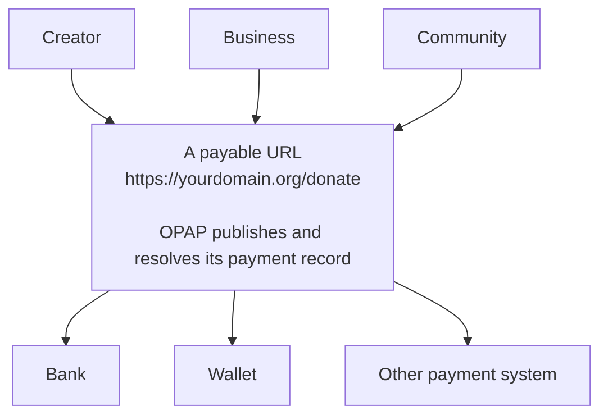

# Open Payment Address Protocol (OPAP)

> A vendor-neutral protocol for publishing and resolving payment instructions from canonical HTTPS URLs.

**Status:** OPAP/1 implementation draft. The specification, schema and conformance fixtures in this repository are the canonical source for this revision. Production payment execution is outside the protocol and is not enabled by this repository.

## Why OPAP

Payment instructions are usually detached from the page, person, business, or community they represent. They live in a payment provider's link, a platform's account, a QR code, or a message that can be changed, removed, or made unavailable by an intermediary.

OPAP lets the owner of a public HTTPS URL publish verifiable payment instructions for that exact URL. A creator can make `/support` payable, a business can make an invoice URL payable, and a collective can make one public page resolve to a transparent split. Payers see the destination and verification evidence before they choose whether and how to pay.

### A freedom protocol

OPAP is designed to remove the central payment-address directory as a control point. A publisher does not need permission from a single platform, wallet, processor, or payment network to make a URL discoverable: they publish a small, open record on a domain they control. Independent applications can resolve that record, and the recipient remains free to choose compatible payment methods.

This makes OPAP useful to people and organisations concerned about deplatforming or debanking. It keeps the public payment identity with the publisher's domain instead of tying it to a provider account or a central alias registry.

OPAP does **not** promise that every layer is censorship-proof. Domain registrars, DNS operators, hosting providers, certificate authorities, wallets, banks, and payment rails may still impose their own rules or restrictions. OPAP reduces one important choke point—the centralised payment-address layer—while leaving payment execution and regulatory obligations to the applications and rails that perform them.

### Adoption without a gatekeeper

OPAP works with infrastructure publishers already use: HTTPS, a well-known path, JSON, and optionally DNSSEC. Adoption can start with one payable page and one compatible resolver; it does not require joining a directory, migrating to a new payment rail, or replacing an existing website. The protocol is designed so that any application can implement it and any domain owner can publish it.

### Where OPAP sits



OPAP is the open layer between a domain-controlled public identity and the payment systems that settle value. It lets the publisher change compatible destinations without changing the URL they share.

## What OPAP does

An **Open Payment Identifier (OPID)** is a canonical HTTPS URL, such as:

```text
https://example.com/donate
https://merchant.example/invoice/2026-001
```

OPAP deterministically derives a same-origin record URL from that identifier. A resolver fetches that record only; it never fetches the submitted page. The record describes a direct destination, a bounded delegation, or an atomic split, which the resolver validates into an explicit execution plan.

```text
canonical HTTPS OPID
        ↓
same-origin OPAP Record
        ↓
schema, semantic and transport validation
        ↓
optional DNSSEC-bound origin proof
        ↓
immutable execution plan for a payer
```

OPAP publishes payment instructions. It does not hold funds, sign transactions, custody keys, operate a wallet, settle a payment, mandate a blockchain or payment provider, or require cloud hosting.

## Repository contents

| Path | Purpose |
| --- | --- |
| [`docs/protocol`](docs/protocol) | Normative OPAP/1 specification in English and Dutch |
| [`schema`](schema) | Normative JSON Schema for an OPAP Record |
| [`conformance`](conformance) | Portable valid and invalid records plus coverage evidence |
| [`packages/opap-core`](packages/opap-core) | Pure parsing, validation, trust and execution-plan logic |
| [`packages/opap-runtime`](packages/opap-runtime) | HTTPS, DNS-over-HTTPS and bounded resolution orchestration |
| [`apps/opap-cli`](apps/opap-cli) | Reference publisher and resolver command-line tool |
| [`docs/implementation/milestone-2-operations.md`](docs/implementation/milestone-2-operations.md) | Publisher, DNSSEC and key-rotation operations |

The protocol intentionally excludes user interfaces, wallets, provider adapters, asset allowlists, smart-contract deployments, custody, and hosting infrastructure. Those belong to independent applications and implementations.

## Start here

- [English OPAP/1 specification](docs/protocol/open-payment-address-protocol-v1.en.md)
- [Nederlandse OPAP/1-specificatie](docs/protocol/open-payment-address-protocol-v1.md)
- [Protocol documentation map](docs/README.md)
- [OPAP Record JSON Schema](schema/open-payment-address-v1.schema.json)
- [Conformance coverage](conformance/coverage.md)

## Implementing OPAP

The reference implementation is a TypeScript workspace. It is useful for studying the protocol and exercising its conformance fixtures; conforming implementations are not required to use TypeScript or these packages.

```shell
npm ci
npm run check
```

Build and use the reference CLI:

```shell
npm run build
node apps/opap-cli/dist/index.js record validate path/to/record.json
node apps/opap-cli/dist/index.js record hash path/to/record.json
node apps/opap-cli/dist/index.js publish check https://example.com/donate
node apps/opap-cli/dist/index.js resolve https://example.com/donate
```

The live commands access the public network. Read the [operations guide](docs/implementation/milestone-2-operations.md) before publishing records or DNSSEC keys.

## Security model

Resolvers must fail closed on malformed identities, redirects, invalid transport profiles, schema or semantic failures, untrusted proofs, recursion limits, and recipient-affecting changes. The protocol validates exact record bytes and supports DNSSEC-bound Ed25519 origin keys; DNSSEC is an optional stronger verification level, not a replacement for HTTPS validation.

This repository is not a payment service and should not be represented as one. See [SECURITY.md](SECURITY.md) for vulnerability reporting and [the specification](docs/protocol/open-payment-address-protocol-v1.en.md) for normative requirements.

## Governance and compatibility

OPAP is intended to be provider-neutral. Protocol changes are proposed through GitHub issues and pull requests, with normative changes accompanied by schema, conformance, and release-note updates. Applications may implement OPAP but must not redefine its normative behavior.

The current repository maintainer is the Open Payment Address GitHub organization. No particular application, payment rail, issuer, wallet, or cloud provider is a protocol dependency.

## Contributing

Please read [CONTRIBUTING.md](CONTRIBUTING.md) and follow the [Code of Conduct](CODE_OF_CONDUCT.md). Security vulnerabilities must be reported privately as described in [SECURITY.md](SECURITY.md), not through public issues.

## License

Copyright 2026 Open Payment Address contributors.

Licensed under the [Apache License, Version 2.0](LICENSE).
