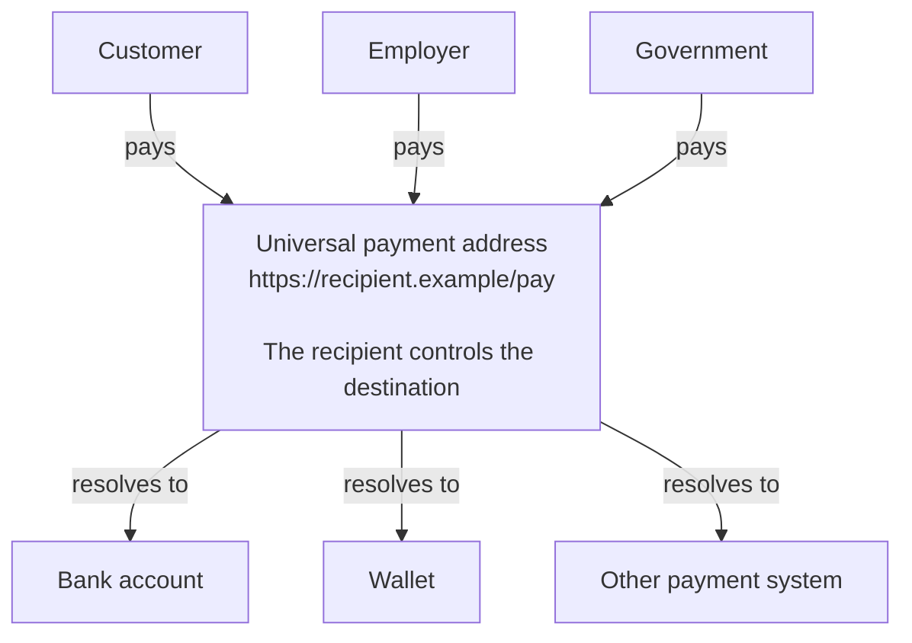

# Open Payment Address Protocol (OPAP)

> A vendor-neutral protocol for publishing and resolving payment instructions from canonical HTTPS URLs.

**Status:** Draft OPAP/1 specification. The specification and schema in this repository define the protocol; the conformance fixtures provide portable examples for implementers.

## DNS for money

**The internet has URLs. Now money does too.**

OPAP turns a canonical public HTTPS URL—including a page on your own domain—into a universal payment address. Anyone can use it to pay. The recipient alone decides where the money arrives.

```text
DNS:  recipient.example             → where to find it
OPAP: https://recipient.example/pay → how to pay it
```

What DNS did for finding websites, OPAP does for getting paid: it connects a stable public name to a destination that can change without changing the name.



The arrows show discovery and routing, not custody. OPAP does not hold or move money. Banks, wallets, chains, and future payment systems continue to settle payments exactly as they do today.

## A freedom protocol

A payment address should belong to its recipient—not to the bank, wallet, marketplace, or platform currently serving them. OPAP separates the stable public identity people pay from the replaceable destination where the money arrives. Keep the URL; change the provider, account, wallet, rail, or routing policy behind it.

There is no central OPAP operator that can suspend an address or demand permission before one is published. Anyone who controls an HTTPS URL can publish payment instructions, and any compatible payer can resolve them. That removes the central directory, platform account, or proprietary payment identifier as a censorship and debanking chokepoint.

A bank may close an account and a wallet provider may block its service, but neither owns the recipient's OPAP address. As long as the recipient retains control of the domain, they can publish another compatible destination without changing the address known to customers, employers, governments, or other payers.

This is freedom at the address layer, not a claim that every underlying rail is permissionless. Registrars, DNS operators, hosting providers, certificate authorities, wallets, banks, and payment rails can still control their own layers. Publishers can reduce those dependencies by owning their domains, using portable hosting, publishing multiple routes, and including rails with different trust models.

## Adoption without permission

OPAP rides on infrastructure that already exists: domains, HTTPS, and today's payment rails. Nothing has to be replaced, and nobody has to move first. One published record and one payer application are already a working system.

- Recipients put one stable payment address on invoices, checkouts, payroll records, subscriptions, profiles, and contracts.
- Wallets and banking apps resolve that address and offer the compatible routes.
- Invoicing and commerce software exchange a durable URL instead of provider-bound account details.
- Registrars and hosting platforms make payable domains a standard feature.

The rails change nothing; OPAP only tells payers where to find the recipient's current instructions. Like email and HTTPS, it is useful to the first publisher on day one and becomes a standard once tools learn to expect it.

## A payment address for anything that can be paid

An OPID can identify a person, organisation, account, or specific payable resource:

- **People** receive wages, freelance income, reimbursements, sales proceeds, or platform payouts through an address they control.
- **Businesses** publish one general payment address or distinct URLs for customers, invoices, orders, branches, and accounts.
- **Commerce** makes existing product, checkout, and subscription URLs directly payable.
- **Employers, marketplaces, and public institutions** pay people without making one bank or wallet identifier their permanent identity.
- **Public services** publish stable addresses for taxes, permits, fines, fees, refunds, and other government payments.
- **Software, services, and machines** expose payable URLs for metered usage, API access, autonomous purchases, or machine-to-machine payments.

```text
https://person.example/pay
https://company.example/invoices/2026-001
https://shop.example/orders/8041
https://city.example/permits/renewal
https://api.example/usage/7f32
```

The URL says **who or what is being paid**. The OPAP Record says **how the recipient currently accepts payment**. The payer application connects the two.

## An open ecosystem around OPAP

OPAP is a protocol layer, not a single product. Independent organisations can build interoperable components around it:

- **OPID hosting:** publish and maintain OPAP Records, HTTPS endpoints, proofs, and key rotation for individuals and organisations. A host can offer instant addresses on its own domain or connect a customer's domain.
- **Domain and hosting integration:** registrars, DNS providers, web hosts, and certificate platforms can make a domain payable and automate optional DNSSEC-bound keys.
- **CMS and commerce plugins:** WordPress, ecommerce, invoicing, membership, and accounting tools can make existing pages, orders, accounts, and invoices payable.
- **Resolver libraries and APIs:** reusable components can canonicalise OPIDs, discover records, validate trust, follow bounded delegation, and produce payment plans.
- **Wallet and banking integrations:** payer applications can accept an OPID by link, paste, QR code, or contact and then execute a compatible payment route.
- **Payroll, invoicing, and marketplace tools:** business software can store the recipient's durable OPID instead of treating changeable bank or wallet details as identity.
- **Developer and conformance tooling:** record builders, validators, linters, test suites, and interoperability labs can make correct implementation routine.
- **Availability and security services:** independent monitors can check records, certificates, DNSSEC proofs, key rotation, and unexpected destination changes.

OPID hosting must not become a new central directory. Custom domains, data export, standards-compliant records, and the ability to move hosting providers preserve the recipient's control. Hosting an address does not require taking custody of funds or operating a payment rail.

## What OPAP does

An **Open Payment Identifier (OPID)** is a canonical HTTPS URL, such as:

```text
https://recipient.example/pay
https://merchant.example/invoice/2026-001
```

OPAP deterministically derives a same-origin record URL from that identifier:

```text
Canonical OPID: https://merchant.example/invoice/2026-001
Path key:       L2ludm9pY2UvMjAyNi0wMDE
Record URL:     https://merchant.example/.well-known/open-payment/record/L2ludm9pY2UvMjAyNi0wMDE
```

A resolver constructs this record URL itself and fetches that record only; it
never fetches the submitted page or follows a publisher-supplied record
location. Payer applications present the canonical HTTPS OPID and can expose
the derived record URL as verification evidence. The record describes a direct
destination, a bounded delegation, or an atomic split, which the resolver
validates into an explicit execution plan.

```text
canonical HTTPS OPID
        ↓
same-origin OPAP Record
        ↓
schema, semantic and transport validation
        ↓
optional origin proof plus exact-host key continuity
        ↓
immutable execution plan for a payer
```

OPAP publishes payment instructions. It does not hold funds, sign transactions, custody keys, operate a wallet, settle a payment, mandate a blockchain or payment provider, or require cloud hosting.

## Repository contents

| Path | Purpose |
| --- | --- |
| [`specification/opap-1.md`](specification/opap-1.md) | Normative OPAP/1 specification |
| [`schema/open-payment-address-v1.schema.json`](schema/open-payment-address-v1.schema.json) | Normative structural schema for an OPAP Record |
| [`conformance/records`](conformance/records) | Portable valid and invalid record fixtures |
| [`conformance/security`](conformance/security) | Recovery-commitment and signed key-transition vectors |
| [`conformance/resolver-state`](conformance/resolver-state) | Trust, history, freshness, DNS, and revalidation scenarios |

This repository intentionally excludes applications, SDKs, wallets, provider adapters, deployment instructions, hosting infrastructure, and reference implementations. Those belong in independent projects.

## Start here

- [OPAP/1 specification](specification/opap-1.md)
- [OPAP Record JSON Schema](schema/open-payment-address-v1.schema.json)
- [Conformance fixture manifest](conformance/records/manifest.json)

## Security model

Resolvers must fail closed on malformed identities, redirects, invalid transport profiles, schema or semantic failures, stale publications, record rollback, origin-key substitution, untrusted proofs or transitions, unavailable security history, recursion limits, and recipient-affecting changes. The protocol validates exact record bytes, pins Ed25519 authority by exact hostname after first successful use, and treats DNSSEC binding separately from key continuity.

Continuity protects returning payers, not first use. It can turn a later origin
takeover into a visible failure, but it cannot keep a lost hostname reachable,
prevent denial of service, or protect a publisher whose signing key is stolen.
A provider-held origin key is custodial publication authority for every OPID on
that hostname. See the specification's limitations table for the exact claims.

This repository is not a payment service and should not be represented as one. See [SECURITY.md](SECURITY.md) for vulnerability reporting and [the specification](specification/opap-1.md) for normative requirements.

## Governance

OPAP is intended to be provider-neutral. Protocol changes are proposed through GitHub issues and pull requests, with normative changes accompanied by corresponding schema and conformance updates. Applications may implement OPAP but must not redefine its normative behavior.

The current repository maintainer is the Open Payment Address GitHub organization. No particular application, payment rail, issuer, wallet, or cloud provider is a protocol dependency.

## Contributing

Please read [CONTRIBUTING.md](CONTRIBUTING.md) and follow the [Code of Conduct](CODE_OF_CONDUCT.md). Security vulnerabilities must be reported privately as described in [SECURITY.md](SECURITY.md), not through public issues.

## License

Copyright 2026 Open Payment Address contributors.

Licensed under the [Apache License, Version 2.0](LICENSE).
